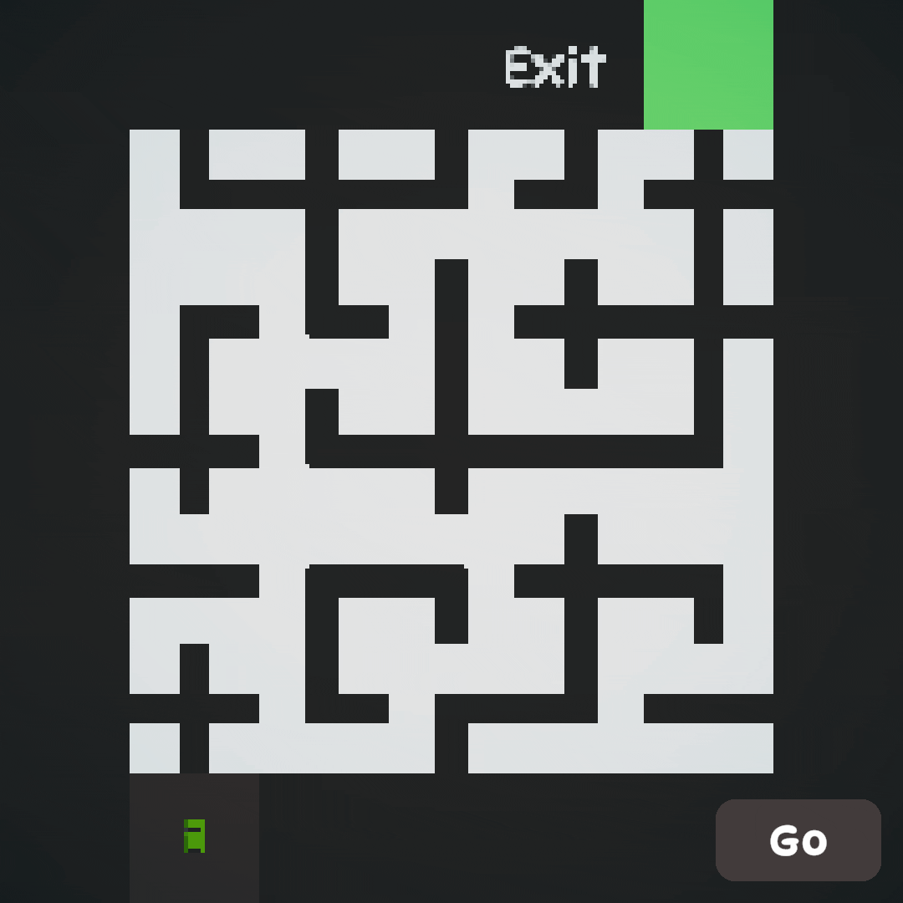

# WFC_Path-Find-Puzzle
<h2>Path Generator using Wave Function Collapse.</h2>
<p1>This Generator uses the Wave Function Collapse algorithm  It calculates selected tile neighbours and show acordingly</p1>
 
<p1>I Learned Wave Function Collapse algorithm from :</p1>
<a href="https://www.youtube.com/watch?v=rI_y2GAlQFM&t=667s">Youtube</a>
 
<h3>
  Download
</h3>
<a href="https://github.com/iShanGameDev/WFC_Path-Find-Puzzle/releases/download/v1.1/WaveFunctionCollapse.unitypackage">New Release</a>

<h1>Preview</h1>

<h1>Game Preview</h1>
<p1>I Made A Simple Game Using This Generator</p1>
 
<a href="https://ishangamedev.itch.io/find-the-exit">Playable Link</a>
 

